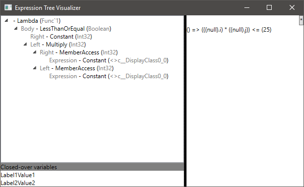
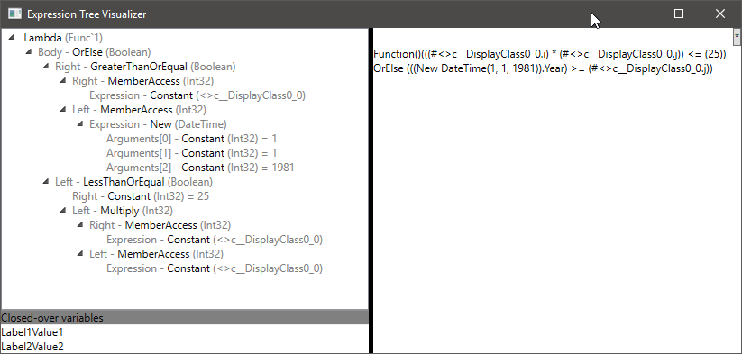

# ExpressionToSyntaxNode
Maps expression trees to Roslyn Syntax Node trees, using the SyntaxNode API for cross-language support

This is inspired by the excellent [ReadableExpressions](https://github.com/agileobjects/ReadableExpressions) project. However, it has the following limitations:

1. code output is only in CSharp
2. closed-over variables in VB.NET expressions are not handled

The goals of this project are:

1. Provide an extension method on expressions that returns a Roslyn syntax tree, in either C# or VB.NET, using the SyntaxNode API as much as possible, but dropping down to the language-specific `SyntaxFactory` as needed.
2. Provide an extension method on expressions that returns a string representation of that tree, with optional trivia insertion.
    * Ideally the trivia insertion will be based on project settings, or the user's IDE settings, if possible
3. Provide a visualizer with a tree representation of the expression, alongside the code

Note that expression support is incomplete -- lots of `NotImplementedException`.

Screenshot of the visualizer (really early days yet; the closed over variables has only dummy values):

Slightly more complicated expression, using Visual Basic:

