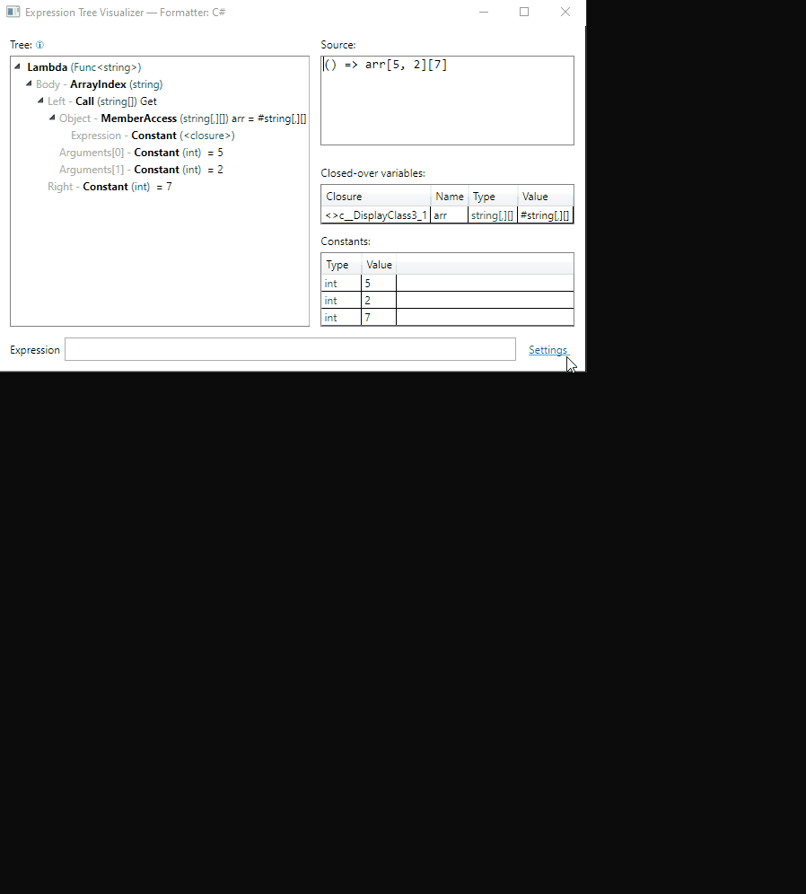

# Expression Tree Visualizer

  

This project provides a custom debugging visualizer for expression trees that can be used with Visual Studio (on Windows). The UI consists of:

1. a graphical treeview of the expression tree structure,
2. [source code representation of the tree](https://github.com/zspitz/ExpressionTreeToString), and
3. end nodes -- nodes in the tree which are not composed of other expressions: parameters, closure variables, constants and default values

You can [switch formatters](https://github.com/zspitz/ExpressionTreeVisualizer/wiki#settings) without reloading the visualizer:

Selection syncing:

* when selecting from the tree:

  

* from source code:

  

* and from end nodes:

  
  
# Requirements / Supports

The visualizer been tested with VS 2019 and VS 2017.

It supports .NET Core, ,NET Framework, and any .NET Standard 2.0 implementation. (Note that .NET Framework < 4.7 [may have issues in VS 2017](https://github.com/zspitz/ANTLR4ParseTreeVisualizer/issues/51).)
  
# Installation

From the ZIP file corresponding to your Visual Studio version (2019 or 2017),

1. Unblock the ZIP file
2. Extract the files to the visualizers folder, preserving the [required folder structure](https://docs.microsoft.com/en-us/visualstudio/debugger/how-to-install-a-visualizer?view=vs-2019#to-install-a-visualizer-for-visual-studio-2019).

# Contributing / Feedback

* [Support Fody](https://opencollective.com/fody); this project uses [Costura](https://github.com/Fody/Costura/) to merge dependent DLLs into a single final DLL, keeping the Visualizers folder clean.
* Test the visualizer. (The significance of this kind of contribution cannot be overestimated.)
* Suggest ideas and enhancements (via [issues](https://github.com/zspitz/ExpressionTreeVisualizer/issues/new/choose))
* Notify about bugs (via [issues](https://github.com/zspitz/ExpressionTreeVisualizer/issues/new/choose))
* Provide screenshots demonstrating different features of the visualizer (via [issues](https://github.com/zspitz/ExpressionTreeVisualizer/issues/new/choose)), to be included in the README or wiki pages
* Star the project
* Spread the word
* Provide feedback to Microsoft about [these limitations to the visualizer API](https://github.com/zspitz/ExpressionToString/wiki/External-issues)

# Credits

* John M. Wright's series on [writing debugger visualizers](https://wrightfully.com/writing-a-readonly-debugger-visualizer)
* Multiple-selection treeview is provided by [MultiSelectTreeView](https://github.com/ygoe/MultiSelectTreeView)
* [ReadableExpressions](https://github.com/agileobjects/ReadableExpressions) for inspiration
* [Greenshot](https://getgreenshot.org/) and [ScreenToGIF](https://www.screentogif.com/) for the screenshots
* [Fody](https://github.com/Fody/Home/) and [Costura](https://github.com/Fody/Costura/)
