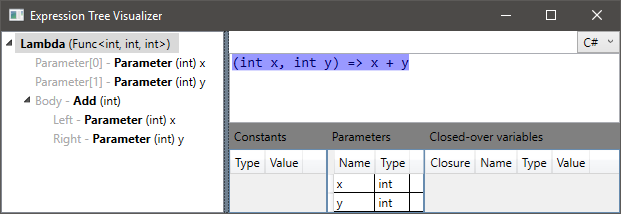
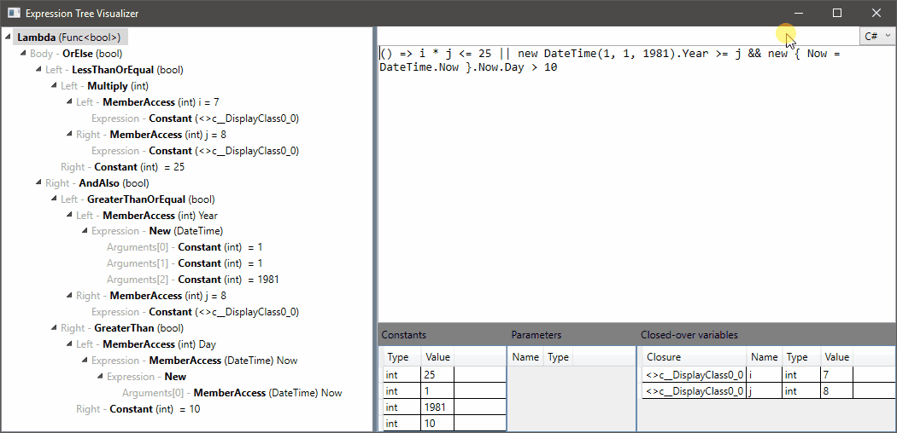
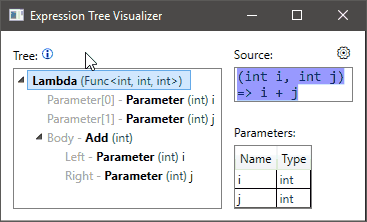
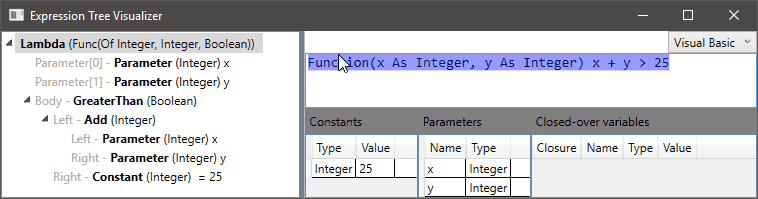
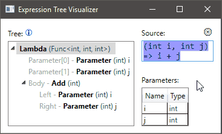

# Expression To String and Expression Tree Visualizer
This project provides the following:

* [](https://www.nuget.org/packages/ExpressionTreeToString/) Extension methods to create a C# or VB.NET code-like string representation, of expression trees or expression tree parts (.NET Standard library)
* [](https://github.com/zspitz/ExpressionToString/releases) A debugging visualizer for expression trees / expression tree parts  
  **Note:** Tested with VS 2017, which only supports custom visualizers in .NET Framework projects  
  **Installation:** The visualizer DLL and the dependent DLL (`MultiSelectTreeView.DLL`), on the [release page](https://github.com/zspitz/ExpressionToString/releases), should be placed in the appropriate folder, as described [here](https://docs.microsoft.com/en-us/visualstudio/debugger/how-to-install-a-visualizer?view=vs-2017).

## String representations of expression trees
```csharp
Expression<Func<bool>> expr = () => true;

Console.WriteLine(expr.ToString("C#")); 
// prints: () => true

Console.WriteLine(expr.ToString("Visual Basic"));
// prints: Function() True
```

Features:

* Support for outputting C#- and VB.NET-style pseudocode (with [more to come](https://github.com/zspitz/ExpressionToString/issues/38))
* Extension methods are rendered as instance methods

    ```csharp
    Expression<Func<int, int>> expr = x => Enumerable.Range(1, x).Select(y => x * y).Count();
    Console.WriteLine(expr.ToString("C#"));
    // prints: (int x) => Enumerable.Range(1, x).Select((int y) => x * y).Count()
    ```

* Closed-over variables are rendered as simple identifiers (instead of member access on the hidden compiler-generated class)

    ```csharp
    var i = 7;
    var j = 8;
    Expression<Func<int>> expr = () => i + j;
    Console.WriteLine(expr.ToString("C#"));
    // prints: () => i + j
    ```

* Special handling of calls to `String.Concat` and `String.Format`

    ```csharp
    var name = "World";
    Expression<Func<string>> expr = () => string.Format("Hello, {0}!", name);
    Console.WriteLine(expr.ToString("C#"));
    // prints: () => $"Hello, {name}!"
    ```

Note that support for the full range of types in `System.Linq.Expressions` is incomplete, but [progressing](https://github.com/zspitz/ExpressionToCode/issues/32).

## Visual Studio debugger visualizer for expression trees



The UI consists of three parts:

1. Tree view of the various parts of an expression tree
2. Source code view, using the above `ExpressionToString` library
3. End nodes -- nodes in the expression tree which are not composed of other expressions

   * Parameters
   * Closed-over variables
   * Constant expressions

Features:

* Live switching between C# and VB.NET

    
    
* Selection syncing when selecting from the tree:

  

  from source code:

  

  and from end nodes:

  

# Credits

* John M. Wright's series on [writing debugger visualizers](https://wrightfully.com/writing-a-readonly-debugger-visualizer)
* Multiple-selection treeview is provided by [MultiSelectTreeView](https://github.com/ygoe/MultiSelectTreeView)
* [ReadableExpressions](https://github.com/agileobjects/ReadableExpressions)
* [Greenshot](https://getgreenshot.org/) and [ScreenToGIF](https://www.screentogif.com/) for the screenshots
